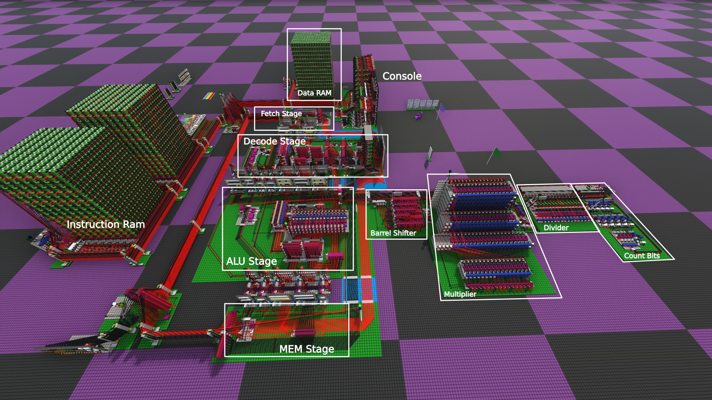

# CPU16X

CPU16X is my CPU built in [Logic World](https://logicworld.net/), a fantastic 3D logic
simulation game. It's similar to redstone in Minecraft, just much easier to work with
and much faster to simulate.

The CPU16X is a RISC processor with:
* 8-tick clock, 1 clock for most instructions.
* 4-stage pipeline with forwarding and hazard logic.
* 7 instructions and 15 ALU operations in 3-operand form.
  * 2-cycle multiplier
  * 16-cycle divider
  * 2-cycle count bits set
* Unified address space with independent instruction and data bus interfaces.
  * A bus crossover allows data accesses to instruction bus and vice-versa with one cycle penalty.

The full computer attaches the CPU to the following devices:
* Memory
  * 512 words of instruction RAM
  * 256 words of data RAM
  * 64 words of boot ROM
* Displays
  * 2x 16-bit hex output displays
  * 16-bit hex input display with keypad
  * 32x32 bitmap display
* Random number generator

The boot ROM runs automatically after reset. It allows you to jump to programs as well as key in new
programs. It also contains memcpy and memset subroutines which can be called by programs.

## Screenshots




[More screenshots](screenshots/)

## Using the computer

Download the world from the [creation hub](https://logicworld.net/view/ctn-6fac6cf6), then follow
the instructions on the various signs to stat the computer and run example programs:

* [Langton's ant](asm/ant.asm)
* [Digits of Pi](asm/pi.asm)
* [1D cellular automata](asm/ca1d.asm)
* [Game of Life](asm/life.asm)

The signs also cover how to enter new programs into the computer using the [boot ROM](asm/rom.asm).
If you want one that is already tested and ready to go, you can check out
[`collatz.asm`](asm/collatz.asm).

## Writing new programs

This repo includes [customasm](https://github.com/hlorenzi/customasm) support for the CPU's
instruction set. You can read through [`cpu16.inc`](asm/cpu16.inc) to get a feel for the instruction
set, then check out all the programs in the [asm](asm) folder. 

To actually assemble programs, run [build.py](build.py) which outputs assembled programs to
`build/`. For `collatz.asm`, this looks like:

```
   outp | addr | data (base 16)

 4100:0 | 4100 |      ; collatz:
 4100:0 | 4100 | 887f ; lw r2, [dev_hex_in]
 4101:0 | 4101 |      ; .loop:
 4101:0 | 4101 | a87e ; sw r2, [dev_hex_out]
 4102:0 | 4102 | c401 ; mov r1, 1
 4103:0 | 4103 | 457d ; beq r1, r2, collatz
 4104:0 | 4104 | 0515 ; and r1, r1, r2
 4105:0 | 4105 | 4405 ; beqz r1, .loop_even
 4106:0 | 4106 | 0910 ; add r1, r2, r2
 4107:0 | 4107 | 0520 ; add r2, r1, r2
 4108:0 | 4108 | c901 ; inc r2
 4109:0 | 4109 | 4078 ; j .loop
 410a:0 | 410a |      ; .loop_even:
 410a:0 | 410a | c47f ; mov r1, -1
 410b:0 | 410b | 0528 ; ls r2, r2, r1
 410c:0 | 410c | 4075 ; j .loop
```

The `addr` column is memory address of the instruction, and the `data` column is the instruction
word to type into the bootrom.

## ISA

The instruction set is surprisingly comfortable for having only 8 different instructions. It gets a
lot of mileage out of the 8 instructions by making clever use of `r0`, the zero-register. Any reads
are zero and any writes are ignored. Instructions like `lw` and `sw` use register + immediate
addressing, but by using `r0` you can access a limited range of absolute addresses.

The main ISA limitation is that immediates can't be used with ALU operations other than add or subtract,
so programs need to load the immediate into spare register before the ALU operation. The fast
pipeline makes this not a significant impact to the program's speed in practice.

## Performance

For a logic world CPU that can execute non-trivial programs like game of life and compute digits of
pi, 8-ticks per instruction is very fast. This is possible thanks to the classic 4-stage pipeline:
fetch, decode, ALU, and memory. The pipeline uses forwarding in the decode stage so that ALU results
can be used immediately in subsequent instructions, even before they are written back to the
register file.

The critical path is, as always, branching. The stages could run at probably 7 or 6 ticks except
that they need time to respond to a branch taken signal, which unfortunately has a few ticks of
delay itself.

The main weakness of the pipeline is its length, coupled with a complete lack of branch prediction.
Any branch taken costs 4 cycles, but the simple loop bodies that this computer is typically
executing are almost always 4-10 instructions. Combine this with a 1-cycle load stall when the load
result is needed by the next instruction, and the CPU spends a significant percentage of its fast
clock cycles stalled.

I don't know when or if I'll build it, but I do have ideas for an improved CPU16XR that has only a
three stage pipeline, ability to same-cycle predict backward branches as taken, and immediates for
ALU instructions. All of these will require a slower cycle time, but it should spend very few cycles
on stalls and come out ahead on performance.

